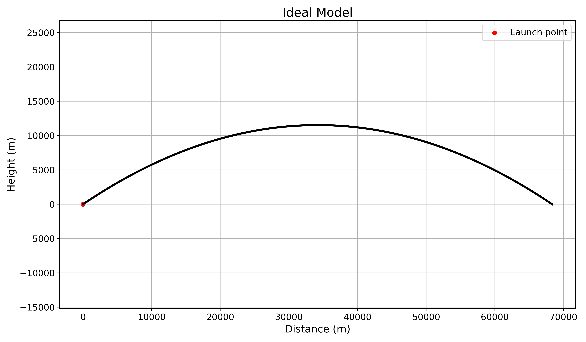
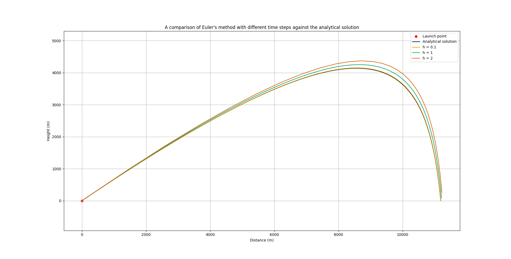
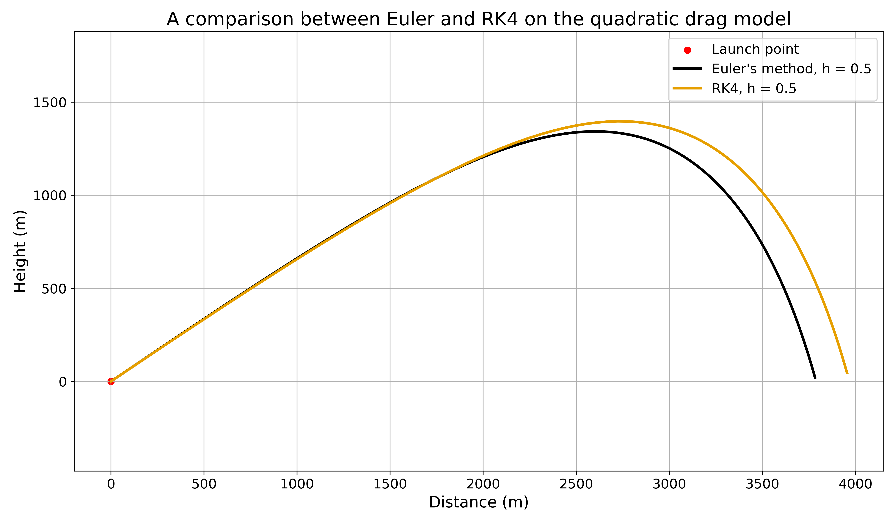

# computational-ballistics

This project explores mathematical modelling and numerical simulation through the study of projectile trajectories, starting from the ideal case with no air resistance and working through progressively more realistic models. Analytical solutions are derived when possible, while numerical approximations are computed using both Euler's method and the fourth order Runge-Kutta (RK4) method.

## Features

- Analytical solution for projectile motion without drag
- Analytical solution for linear drag
- Euler method implementation
- Fourth order Runge-Kutta (RK4) implementation
- Quadratic drag model
- Comparison of analytical and numerical solutions
- Trajectory visualization with Matplotlib

## Table of Contents
- [1. Ideal model (no drag)](#1-ideal-model-no-drag)
- [2. Linear drag model](#2-linear-drag-model)
- [3. Quadratic drag model](#3-quadratic-drag-model)

## 1. Ideal model (no drag)

### Analytical solution

The objective of this project being to model the trajectory of a bullet, we first assume an idealized object of mass (m) that is launched from the point $(x_0,y_0)$ with speed v and at angle $\theta$  
From Newton's second law, we know that

$$
\sum \vec{F_{ext}} = m\vec{a}
$$

Assuming that the only force exerted on the projectile is its weight, we can derive that   

$$
\sum \vec{F_{ext}} = \vec{P} = m\vec{a}
$$ 

Given that $\vec{P} = m\vec{g}$, we can conclude  

$$
m\vec{a} = m\vec{g}
$$

This yields the two component equations:  

$$
\begin{cases}
a_x = 0 \\
a_y = -g
\end{cases}
$$

Integrating with respect to time gives: 

$$
\begin{cases}
v_x = v_{x0} \\
v_y = -gt + v_{y0}
\end{cases}
$$

With: 

$$
\begin{cases}
v_{x0} = v \cos(\theta)  \\
v_{y0} = v \sin(\theta)
\end{cases}
$$

Integrating once more yields the position: 

$$
\begin{cases}
x =  v\cos(\theta)t + x_{0} \\
y = -\frac{g}{2}t^2 + v\sin(\theta)t + y_0
\end{cases}
$$

Assuming that ground level is at y = 0, we can calculate the flight time by solving the equation y(t) = 0

$$
0 = -\frac{g}{2}t_{flight}^2 + v\sin(\theta)t_{flight} + y_0
$$

Using the quadratic formula:

$$
t_{flight} = \frac{v\sin(\theta) \pm \sqrt{v^2\sin^2(\theta) + 2gy_0}}{g}
$$

We take the positive root, since time cannot be negative. The flight time is thus:

$$
t_{flight} = \frac{v\sin(\theta) + \sqrt{v^2\sin^2(\theta) + 2gy_0}}{g}
$$

Using these expressions, I wrote code that calculated the trajectory in "Ideal.py" and represented it on a graph using NumPy and Matplotlib.

### Results

The trajectory is a perfect parabola, which is to be expected given the only force exerted on the projectile is gravity.

## 2. Linear drag Model

### Analytically solving the system
Considering the fact that air resistance plays an important role in the trajectory at high speeds, we will first introduce a linear drag model.
Even though quadratic drag is more physically accurate at high velocities, we start with a linear drag model mainly as a benchmark against which to test different numerical methods to solve ODEs, since obtaining analytical solutions will quickly become impractical.  

The updated equation gives us:  

$$
\sum \vec{F_{ext}} = \vec{P} - k\vec{v} = m\vec{a}
$$ 

Where k is the drag coefficient in $kgs^{-1}$

From this we can again derive two differential equations: 

$$
\begin{cases}
ma_x = -kv_x \\
ma_y = -mg - kv_y
\end{cases}
$$

These differential equations are still analytically solvable. We will use these solutions as benchmarks to validate the accuracy of our numerical methods later.

We can rewrite these two equations as: 

$$
\begin{cases}
m\frac{dv_x}{dt} = -kv_x \\
m\frac{dv_y}{dt} = -mg - kv_y
\end{cases}
$$

i.e., 

$$
\begin{cases}
\frac{dv_x}{dt} = -\frac{k}{m}v_x \\
\frac{dv_y}{dt} = -g - \frac{k}{m}v_y
\end{cases}
$$

The first equation is a homogeneous ODE; solving it yields: 

$$
v_x(t) = \Delta e^{-\frac{k}{m}t}
$$

The second one is a nonhomogeneous ODE. We must first solve the homogeneous equation  $\frac{dv_y}{dt} + \frac{k}{m}v_y = 0$; which is the same as the first equation, therefore: 

$$
v_{yh}(t) = C e^{-\frac{k}{m}t}
$$

Observing that $v_{yp} : t \mapsto - \frac{m}{k}g$ is a particular solution of the equation, we can conclude that $v_y$ is given by: 

$$
v_{y}(t) = C e^{-\frac{k}{m}t} -\frac{m}{k}g
$$

Which yields the velocity equations:

$$
\begin{cases}
v_x(t) = \Delta e^{-\frac{k}{m}t} \\
v_{y}(t) = C e^{-\frac{k}{m}t} -\frac{m}{k}g
\end{cases}
$$

Using the initial conditions: 

$$
\begin{cases}
v_{x0} = v\cos(\theta) \\
v_{y0} = v\sin(\theta)
\end{cases}
$$

We can conclude with the two completed velocity equations: 

$$
\begin{cases}
v_x(t) = v\cos(\theta) e^{-\frac{k}{m}t} \\
v_{y}(t) = (v\sin(\theta) + \frac{m}{k}g) e^{-\frac{k}{m}t} -\frac{m}{k}g
\end{cases}
$$

Taking the limit as ${t \to \infty}$ yields us with the terminal velocity:

$$
\begin{cases}
\lim_{t \to \infty} v_x(t) = 0 \\
\lim_{t \to \infty} v_{y}(t) = -\frac{m}{k}g
\end{cases}
$$

i.e.,

$$
v_{max} = \frac{m}{k}g
$$

Integrating the velocity equations with respect to time yields the position equations below: 

$$
\begin{cases}
x(t) = -\frac{m}{k} v\cos(\theta) e^{-\frac{k}{m}t} + C \\
y(t) = -\frac{m}{k} (v\sin(\theta) + \frac{m}{k}g) e^{-\frac{k}{m}t} -\frac{m}{k}gt + C
\end{cases}
$$

And finally: 

$$
\begin{cases}
x(t) = \frac{m}{k} v\cos(\theta)(1 - e^{-\frac{k}{m}t}) + x_0  \\
y(t) = \frac{m}{k} (v\sin(\theta) + \frac{m}{k}g) (1- e^{-\frac{k}{m}t}) -\frac{m}{k}gt + y_0
\end{cases}
$$

These analytical solutions provide a reference against which numerical methods such as Euler and Runge–Kutta methods can be evaluated. We will have to rely on numerical approximations of the solutions once quadratic drag is introduced, since analytical solutions will no longer be easily obtained.

### Euler's method

Euler's method is a numerical technique for solving differential equations of the form:   

$$
\frac{dy}{dx} = f(x,y)
$$ 

With initial conditions $(x_0,y_0)$   
It works as follows:   
Given a step size _h_ , we can compute successive approximations of y with the following formula:  

$$
\begin{cases}
y_{n+1} = y_n + hf(x_n,y_n) \\
x_{n+1} = x_n + h
\end{cases}
$$

This approximation comes directly from the first-order Taylor expansion of y : 

$$
y(x+h) = y(x) + hy'(x) + O(h^2)
$$

Taking $x + h = x_{n+1}$ and $x = x_n$ :  

$$
y(x_{n+1}) = y(x_n) + hy'(x_n) + O(h^2)
$$

Since $\frac{dy}{dx} = y' = f(x,y)$, the formula becomes:

$$
y(x_{n+1}) = y(x_n) + hf(x_n,y(x_n)) + O(h^2)
$$

Neglecting the higher order term $O(h^2)$ yields Euler's method:

$$
\begin{cases}
y_{n+1} = y_n + hf(x_n,y_n) \\
x_{n+1} = x_n + h
\end{cases}
$$

The local truncation error is therefore $O(h^2)$, while the global error accumulated over many steps is O(h).

It is worth noting that y(x) does not have to be a scalar and can indeed be a vector in $\mathbb{R}^n$ , provided that $f : \mathbb{R}^n \to \mathbb{R}^n$. This will prove useful in the next section.

### Numerical application

In our case, the ODE system we are trying to solve is : 

$$
\begin{cases}
\frac{dv_x}{dt} = -\frac{k}{m}v_x \\
\frac{dv_y}{dt} = -g - \frac{k}{m}v_y \\
\frac{dx}{dt} = v_x  \\
\frac{dy}{dt} = v_y 
\end{cases}
$$

Using Euler's method requires modeling the state of our system as a state vector:

$$
\mathbf{s} =
\begin{bmatrix}
v_x \\
v_y \\
x \\
y
\end{bmatrix}
$$

$\frac{d\mathbf{s}}{dt}$ then becomes : 

$$
\begin{bmatrix}
\frac{dv_x}{dt} \\
\frac{dv_y}{dt} \\
\frac{dx}{dt} \\
\frac{dy}{dt}
\end{bmatrix}
$$

Which is exactly : 

$$
\begin{bmatrix}
-\frac{k}{m}v_x\\
-g - \frac{k}{m}v_y \\
v_x \\
v_y
\end{bmatrix}
$$

i.e.,

$$
\frac{d\mathbf{s}}{dt} =
\begin{bmatrix}
-\frac{k}{m}v_x\\
-g - \frac{k}{m}v_y \\
v_x \\
v_y
\end{bmatrix}
= f(t,\mathbf{s})
$$

We therefore define the function f by:

$$
f(t,\mathbf{s}) = 
\begin{bmatrix}
-\frac{k}{m}v_x\\
-g - \frac{k}{m}v_y \\
v_x \\
v_y
\end{bmatrix}
$$

And use it to approximate the values of $\mathbf{s}$ using Euler's method:

$$
\begin{cases}
\mathbf{s_{n+1}} = \mathbf{s_n} +  hf(t_n,\mathbf{s_n}) \\
t_{n+1} = t_n + h
\end{cases}
$$

It is worth noting that f does not strictly depend on time and could be written as $f(\mathbf{s})$, I decided to stick to the general version for clarity purposes, given that Euler's method is presented as such.

### Results

We can see here that Euler's method is more accurate as the time step approaches 0, with errors starting to appear the longer the simulation is running.

The implementation of this model as well as the comparison between Euler's method and the analytical solution can be found in "models/linear_drag.py"

## 3. Quadratic Drag Model

As explained previously, the linear drag model is inaccurate at high speeds. To accurately account for air resistance at bullet speeds, we consider quadratic drag, defined by

$$
F_d = -k \vec{v}|v|
$$

Where: 

$$
|v| = \sqrt{v_x^2 + v_y^2}
$$

When considering this drag force, Newton's second law becomes: 

$$
\sum \vec{F_{ext}} = \vec{P} - k\vec{v}|v| = m\vec{a}
$$ 

This yields the component equations: 

$$
\begin{cases}
\frac{dv_x}{dt} = - \frac{k}{m}|v|v_x \\
\frac{dv_y}{dt} = - \frac{k}{m}|v|v_y -g 
\end{cases}
$$ 

These equations form a system of coupled nonlinear, nonhomogeneous ordinary differential equations. Since no simple closed-form solution exists for the general case, Euler's method will be used to obtain a numerical approximation of the trajectory.    

Since Euler's method has been presented in section two, we will simply model the governing equations using the same state vector as the linear drag model:

$$
\mathbf{s} =
\begin{bmatrix}
v_x \\
v_y \\
x \\
y
\end{bmatrix}
$$

i.e.,

$$
\frac{d\mathbf{s}}{dt} =
\begin{bmatrix}
-\frac{k}{m}|v|v_x \\
-\frac{k}{m}|v|v_y -g  \\
v_x \\
v_y
\end{bmatrix}
= f(t,\mathbf{s})
$$

We therefore define the function f by:

$$
f(t,\mathbf{s}) = 
\begin{bmatrix}
-\frac{k}{m}|v|v_x \\
-\frac{k}{m}|v|v_y -g  \\
v_x \\
v_y
\end{bmatrix}
$$

And use it to approximate the values of $\mathbf{s}$ using Euler's method:

$$
\begin{cases}
\mathbf{s_{n+1}} = \mathbf{s_n} +  hf(t_n,\mathbf{s_n}) \\
t_{n+1} = t_n + h
\end{cases}
$$

### Fourth order Runge-Kutta (RK4)

The fourth order Runge-Kutta method is another numerical technique for solving differential equations of the same form as Euler's, i.e.,

$$
\frac{dy}{dx} = f(x,y)
$$ 

Given the initial conditions $(x_0,y_0)$   

It works as follows:   

Given a step size _h_ , we can compute successive approximations of y with the following formula:  

$$
\begin{cases}
y_{n+1} = y_n + \frac{h}{6} (k_1 +2k_2 + 2k_3 + k_4) \\
x_{n+1} = x_n + h
\end{cases}
$$

Where:

$$
\begin{cases}
k_1 = f(x_n,y_n) \\
k_2 = f(x_n + \frac{h}{2} ,y_n + \frac{h}{2}k_1 ) \\
k_3 = f(x_n + \frac{h}{2} ,y_n + \frac{h}{2}k_2 ) \\
k_4 = f(x_n + h ,y_n + hk_3 )
\end{cases}
$$

The RK4 method can be derived by matching the fourth-order Taylor expansion of the exact solution. The coefficients $k_1$ through $k_4$ are chosen to that effect. The derivation being rather lengthy, it is left as an exercise for the reader.

### Results

The figure below compares projectile trajectories computed using Euler's method and RK4:

We can see that RK4 stays accurate longer, while the error accumulates rather quickly for Euler's method.

## 4. Stochastic Simulations

Having implented the quadratic drah model, we will use the RK4 implentation to introduce uncertainty into the launch conditions. Specifically, this will be done by modeling the launch angle as a normal law:

$$
\theta \sim \mathcal{N}(\theta _m, \sigma^2)
$$

